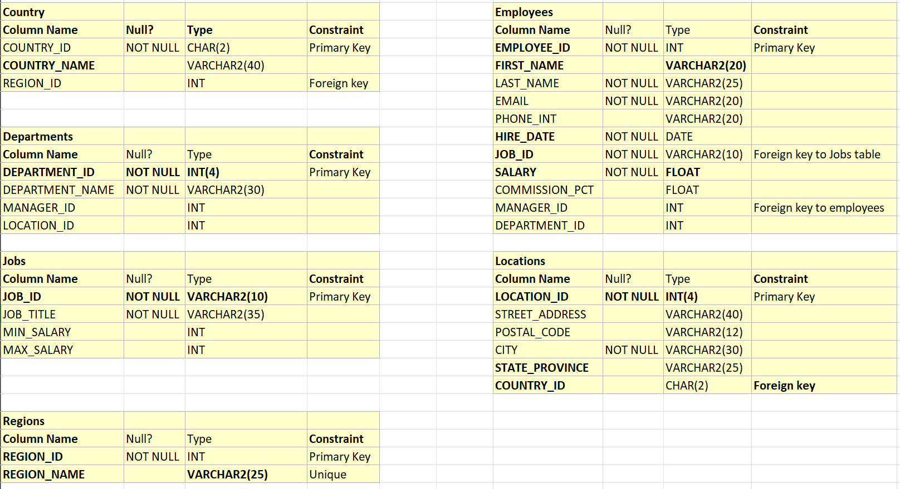
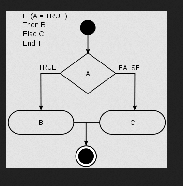

# Java Assignments

## Assignment 1




This is the schema for the HR dataset. Your task is to create corresponding java classes for these tables. All the identifiers must be according to Java naming conventions.

## Assignment 2

Write a Java program that would store all 12 months of the year in an array. The program should then print out the months in the following format:
```
January has 31 Days
February has 28 Days
March has 31 Days
April has 30 Days
May has 31 Days
June has 30 Days
July has 31 Days
August has 31 Days
September has 30 Days
October has 31 Days
November has 30 Days
December has 31 Days
```

## Assignment 3

Test your knowledge of using if-else conditional statements to automate decision-making processes. An if-else statement has the following logical flow:



Task
Given an integer `x`, perform the following conditional actions:

Verify that `x` is between `1` and `100`.

- If `x` is odd, print Weird
- If `x`is even and in the inclusive range of `2` to `5`, print Not Weird
- If `x` is even and in the inclusive range of `6` to `20` , print Weird
- If `x` is even and greater than `20`, print Not Weird

## Assignment 4

Given and integer `x`, print it's first 10 multiples.

Verify that `x` is between `2` and `20`.

Sample input

```
x = 2
```

Sample Output
```
2 x 1 = 2
2 x 2 = 4
2 x 3 = 6
2 x 4 = 8
2 x 5 = 10
2 x 6 = 12
2 x 7 = 14
2 x 8 = 16
2 x 9 = 18
2 x 10 = 20
```

## Assignment 5

**PasswordChecker**

Create a Java program called `PasswordChecker`, which takes a `String` password as input and checks if it is valid. A password is valid id it satisfies the following conditions:

- It is a non-empty string.
- It contains at least one uppercase character.
- It contains at leat one special charecter `[$, #, %, &, -, _]`.
- It is altleast 8 characters long.

Is the password is valid print **"Valid Password"** otherwise print throw a custom `InvalidPasswordException`.